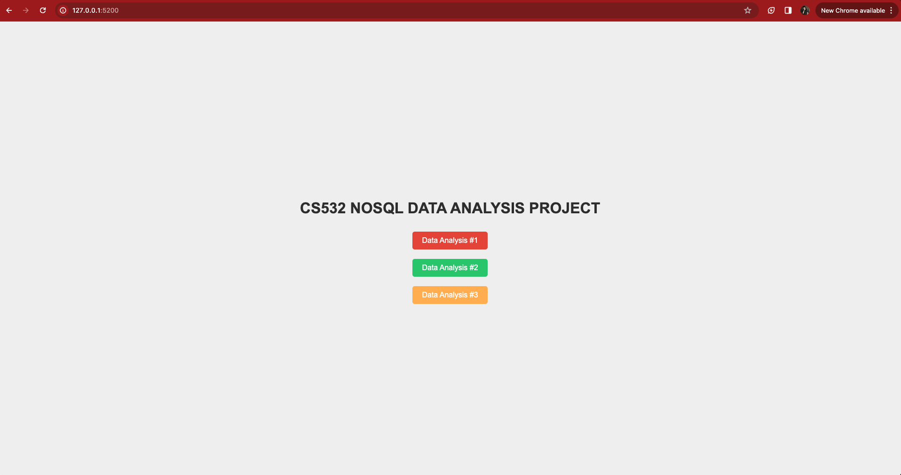
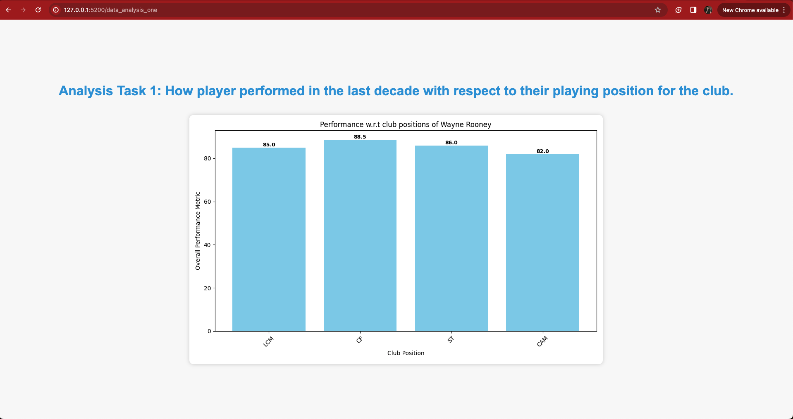
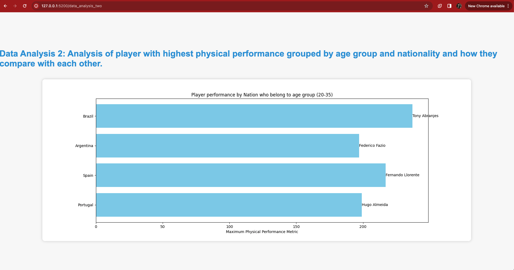
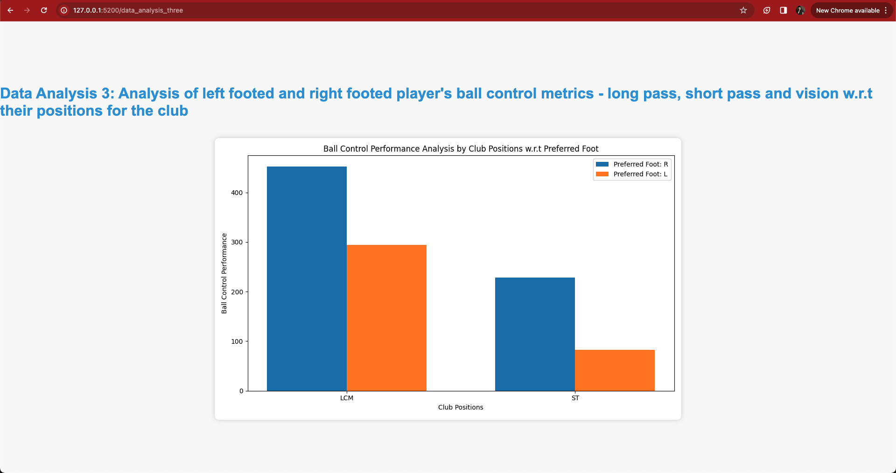

# CS532 NoSQL Data Analysis Project

## Team Members

Tanmay Chaudhari  
Mihir Shah

## Project setup and environment

Git clone the project.  

Add a .flaskenv file and paste the below variables.

```
FLASK_APP=app.py
FLASK_ENV=development
FLASK_RUN_HOST=0.0.0.0
FLASK_RUN_PORT=[PORT]
```

Add a .env file and paste the below variables
```
# DB Details
CONNECTION_PASS=[password]
DB_NAME=[name]
```


Create a virtual env  
```
python3 -m venv analysis_nosql
```

activate virtual env  
```
source analysis_nosql/bin/activate
```

install dependencies in virtual env  
```
pip3 install -r requirements.txt
```

To run the app  
```
flask run [--debug]
```

## Screenshots:

`/`



`/data_analysis_one`



`/data_analysis_two`



`/data_analysis_three`

